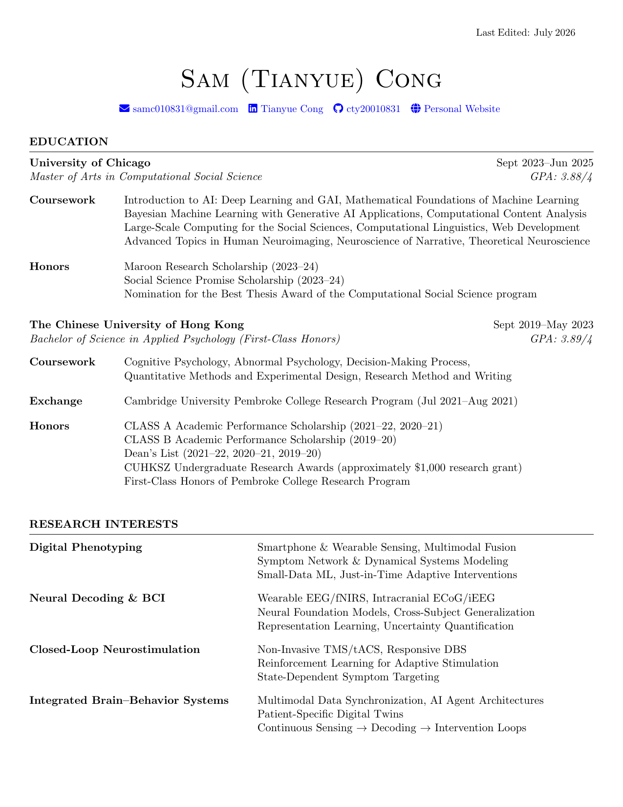

<div align="center">

# Academic CV — Sam (Tianyue) Cong

*PhD Student, Neurobiology & Behavior · Columbia University*

[](https://www.latex-project.org/)
[](https://mgeier.github.io/latexmk.html)
[](https://github.com/cty20010831/Academic_CV/commits/main)
[](#license)

[**Download the latest PDF**](Academic_CV_Tianyue_Cong.pdf)



</div>

---

## Contents

- [About](#about)
- [Repository Structure](#repository-structure)
- [Local Compilation](#local-compilation)
- [Customization Notes](#customization-notes)
- [Sections in the CV](#sections-in-the-cv)
- [Editor Setup](#editor-setup)
- [Attribution](#attribution)
- [License](#license)

---

## About

This repository contains the LaTeX source for my academic CV. It is built on the [Medium Length Professional CV](https://www.latextemplates.com/template/medium-length-professional-cv) template from [LaTeXTemplates](http://www.LaTeXTemplates.com), with a custom bibliography setup for grouping publications by status (published, under review, in preparation, poster) and sorting them year-then-month descending.

> **Note on Overleaf.** As of 2026-07-10, Overleaf's free tier no longer supports GitHub integration. This repo lives on my local Desktop and compiles locally — see below.

## Repository Structure

| File | Purpose |
| --- | --- |
| `resume.tex` | Main document |
| `resume.cls` | Custom class (sections, spacing, fonts) |
| `ref.bib` | Publications, preprints, posters |
| `build.sh` | One-shot build script (`./build.sh`) |
| `.latexmkrc` | latexmk config (pdflatex + biber, output jobname) |
| `.gitignore` | Excludes LaTeX build artifacts |
| `Academic_CV_Tianyue_Cong.pdf` | Latest rendered PDF |
| `preview.png` | Preview thumbnail for this README |

## Local Compilation

### Prerequisites

- **macOS**: [MacTeX](https://www.tug.org/mactex/) (full distribution). Installs to `/Library/TeX/texbin/`.
- **Linux**: `texlive-full` (Debian/Ubuntu) or the equivalent full TeX Live install.
- **Windows**: [TeX Live](https://tug.org/texlive/) or [MiKTeX](https://miktex.org/).

Required tools (all bundled with a full TeX Live install): `pdflatex`, `biber`, `latexmk`.

### Build

From the repo root:

```bash
./build.sh
```

The script wraps `latexmk` — it runs the full pdflatex → biber → pdflatex → pdflatex sequence on a cold build, incrementally rebuilds when you edit `resume.tex` / `resume.cls` / `ref.bib`, and cleans aux files afterward. Output is `Academic_CV_Tianyue_Cong.pdf` (filename set in `.latexmkrc`).

<details>
<summary>What <code>build.sh</code> does</summary>

```bash
#!/usr/bin/env bash
set -euo pipefail
cd "$(dirname "$0")"
latexmk -pdf resume.tex   # build; latexmk skips unchanged passes
latexmk -c                # remove aux files, keep PDF
```
</details>

<details>
<summary>Manual sequence (if you'd rather not use the script)</summary>

```bash
pdflatex -jobname=Academic_CV_Tianyue_Cong resume.tex
biber Academic_CV_Tianyue_Cong
pdflatex -jobname=Academic_CV_Tianyue_Cong resume.tex
pdflatex -jobname=Academic_CV_Tianyue_Cong resume.tex
```
</details>

### Clean up build artifacts

```bash
latexmk -c    # remove aux files, keep the PDF
latexmk -C    # remove aux files AND the PDF
```

## Customization Notes
- **Custom sort order (`ymdnt`)** — Publications sort by year and month, both descending, then by name and title. Defined in `resume.tex` via `\DeclareSortingScheme`.
- **Bolding my own name** — In `ref.bib`, add the annotation `author+an = {1=highlight}` (where `1` is the position in the author list). The `\mkbibnamefirst` / `\mkbibnamefamily` hooks in `resume.tex` render highlighted names in bold.
- **Publication categories** — `underreview`, `inpreparation`, and `poster` are declared with `\DeclareBibliographyCategory` and filtered via `\nocite`/`\printbibliography[category=...]`. This works around biblatex-apa's lack of a `keywords` package option.
- **Last-edited stamp** — The top-right "Last Edited: Month Year" is generated automatically via `\mydate\today`.

## Sections in the CV

- Education
- Research Interests
- Research Experience
- Skills
- Publications
- Conference Presentations
- Professional Activities
- Teaching Experience
- Service and Leadership

## Editor Setup

Recommended: **VS Code + [LaTeX Workshop](https://marketplace.visualstudio.com/items?itemName=James-Yu.latex-workshop)** — auto-build on save, side-by-side PDF preview, forward/inverse search via SyncTeX.

Minimal `.vscode/settings.json` snippet:

```json
{
  "latex-workshop.latex.recipe.default": "latexmk",
  "latex-workshop.latex.autoBuild.run": "onSave"
}
```

## Attribution

Template: [Medium Length Professional CV](https://www.latextemplates.com/template/medium-length-professional-cv) by Trey Hunner, hosted at [LaTeXTemplates.com](http://www.LaTeXTemplates.com). Licensed CC BY-NC-SA 3.0.

## License

Source code (customizations, class modifications): MIT.
Content (the CV itself): © Tianyue Cong. All rights reserved.
